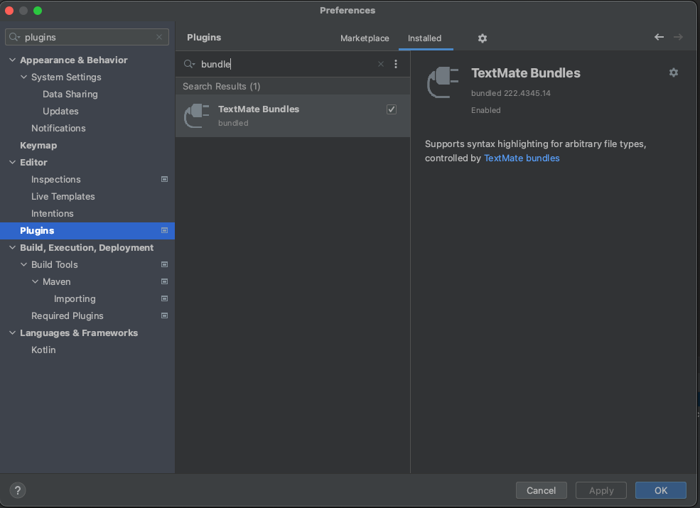
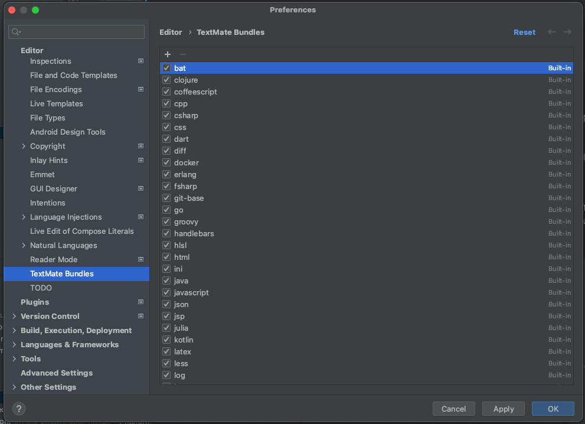
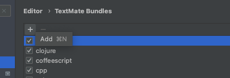
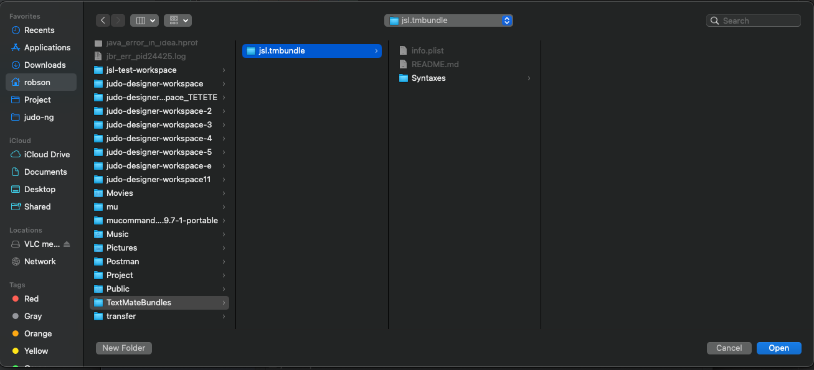
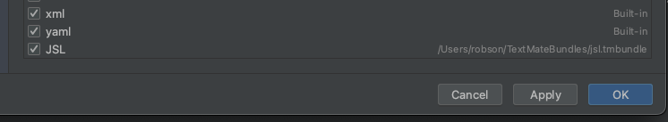
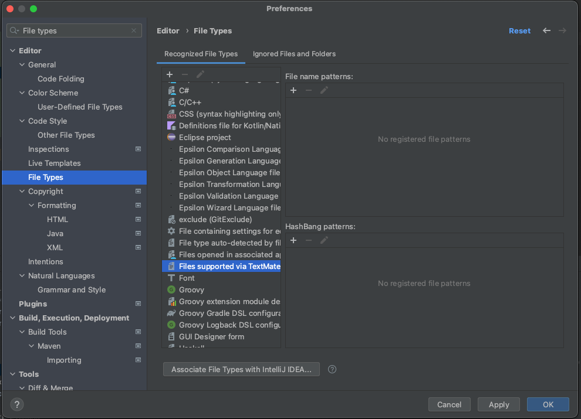
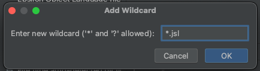

# Intallation for Idea

1. Checkout https://github.com/BlackBeltTechnology/jsl.tmbundle to a directory which is kept. (For example ~/TextMateBundles)

1. Check the installation of TextMate Bundles - it its not activated, activate it.
+

2. Open installed TextMate bundles
+

3. Add new tmbundle extension
+

4. Select checked out `jsl.tmbundle` directory
+

5. Check JSL is installed
+

6. Associate `.jsl` files to TextMate bundle.
+

6. Add `*.jsl` to file name pattern.
+

